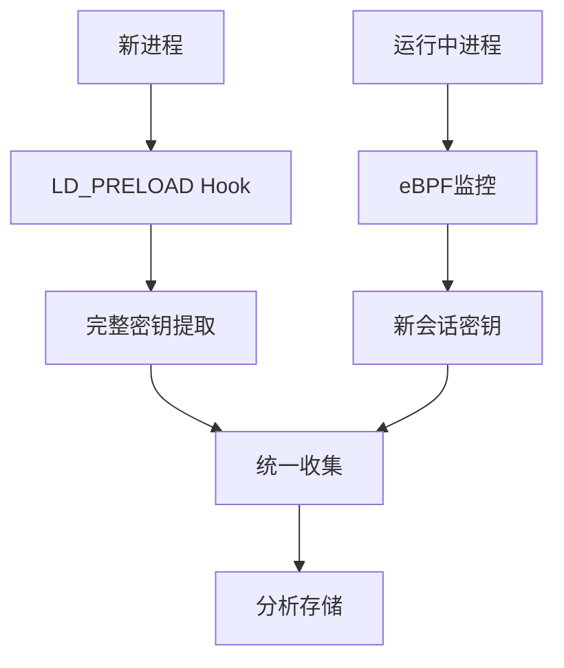

# TLS密钥实时捕获能力分析

## 问题分析

**核心问题**: 是否可以在不重启服务/主机的情况下，直接提取部署设备上所有TLS会话的密钥信息？

**答案**: 可以，但需要不同的技术手段，各有优劣。

## 当前实现分析

### 1. LD_PRELOAD Hook 方式的限制

当前项目使用的主要技术是 **LD_PRELOAD Hook**，其工作原理：

```c
// 拦截OpenSSL函数调用
int SSL_write(SSL *ssl, const void *buf, int num) {
    // 1. 调用原始函数
    int result = original_SSL_write(ssl, buf, num);

    // 2. 检查握手状态并提取密钥
    if (is_handshake_complete(ssl)) {
        extract_tls_keys(ssl);
    }

    return result;
}
```

**限制分析**:

❌ **需要重启服务**: LD_PRELOAD必须在进程启动时设置
❌ **只能捕获新连接**: 无法捕获已经建立的TLS会话
✅ **密钥完整性好**: 可以捕获完整的握手过程
✅ **实现简单可靠**: 技术成熟，兼容性好

### 2. 技术能力对比

| 技术方案 | 无需重启 | 覆盖现有连接 | 实现复杂度 | 兼容性 | 安全性 |
|---------|---------|-------------|----------|-------|--------|
| LD_PRELOAD | ❌ | ❌ | 低 | 高 | 高 |
| eBPF kprobe | ✅ | ❌ | 高 | 中 | 中 |
| eBPF uprobe | ✅ | ❌ | 高 | 中 | 中 |
| 动态注入 | ✅ | ❌ | 高 | 低 | 低 |
| GDB调试 | ✅ | ❌ | 中 | 中 | 低 |
| 内存扫描 | ✅ | ✅ | 极高 | 极低 | 极低 |

## 无重启捕获的技术方案

### 方案1: eBPF kprobe 追踪系统调用

```c
// eBPF程序示例 - 追踪SSL_write调用
#include <linux/bpf.h>
#include <bpf/bpf_helpers.h>

struct ssl_data_event {
    u32 pid;
    u64 timestamp;
    char comm[16];
    u8 client_random[32];
};

SEC("kprobe/SSL_write")
int trace_ssl_write(struct pt_regs *ctx) {
    struct ssl_data_event event = {};
    u32 pid = bpf_get_current_pid_tgid() >> 32;

    // 获取进程信息
    bpf_get_current_comm(&event.comm, sizeof(event.comm));
    event.pid = pid;
    event.timestamp = bpf_ktime_get_ns();

    // 尝试从SSL结构中提取Client Random
    // 这里需要复杂的内存访问和偏移计算

    bpf_perf_event_output(ctx, &events, BPF_F_CURRENT_CPU,
                         &event, sizeof(event));
    return 0;
}
```

**优势**:
- ✅ 无需重启目标进程
- ✅ 系统级监控
- ✅ 性能开销小

**挑战**:
- ❌ 无法直接访问用户空间内存结构
- ❌ SSL结构体偏移复杂且版本相关
- ❌ 只能捕获新的SSL调用

### 方案2: eBPF uprobe 追踪库函数

```c
// uprobe追踪OpenSSL库函数
SEC("uprobe/libssl.so:SSL_write")
int trace_ssl_write_uprobe(struct pt_regs *ctx) {
    void *ssl_ptr = (void*)PT_REGS_PARM1(ctx);

    // 读取SSL结构体内容
    struct ssl_st ssl;
    if (bpf_probe_read_user(&ssl, sizeof(ssl), ssl_ptr) != 0) {
        return 0;
    }

    // 提取Client Random
    if (ssl.s3) {
        struct ssl3_state_st s3;
        if (bpf_probe_read_user(&s3, sizeof(s3), ssl.s3) == 0) {
            // 获取client_random
            send_event(s3.client_random);
        }
    }

    return 0;
}
```

**优势**:
- ✅ 可以访问库函数内部
- ✅ 更精确的函数调用追踪

**挑战**:
- ❌ 需要知道确切的库路径
- ❌ 结构体布局复杂
- ❌ 版本兼容性问题

### 方案3: 动态库注入 (GOT Hook)

```c
// 运行时注入Hook库
#include <dlfcn.h>
#include <sys/mman.h>

int inject_hook_library(pid_t target_pid) {
    // 1. 附加到目标进程
    if (ptrace(PTRACE_ATTACH, target_pid, NULL, NULL) == -1) {
        return -1;
    }

    // 2. 在目标进程中分配内存
    void *remote_mem = mmap_process(target_pid, size);

    // 3. 注入Hook库代码
    write_process_memory(target_pid, remote_mem, hook_lib, size);

    // 4. 修改GOT表项
    modify_got_entry(target_pid, "SSL_write", hook_ssl_write);

    // 5. 分离进程
    ptrace(PTRACE_DETACH, target_pid, NULL, NULL);

    return 0;
}
```

**优势**:
- ✅ 可以对运行中进程注入
- ✅ 立即生效

**挑战**:
- ❌ 实现极其复杂
- ❌ 稳定性风险高
- ❌ 容易被检测

### 方案4: 内存扫描分析

```c
// 扫描进程内存寻找SSL结构
int scan_process_memory(pid_t pid) {
    char maps_path[256];
    snprintf(maps_path, sizeof(maps_path), "/proc/%d/maps", pid);

    FILE *maps = fopen(maps_path, "r");
    char line[1024];

    while (fgets(line, sizeof(line), maps)) {
        unsigned long start, end;
        if (sscanf(line, "%lx-%lx", &start, &end) == 2) {
            // 扫描内存区域寻找SSL结构
            scan_memory_region(pid, start, end);
        }
    }

    return 0;
}
```

**优势**:
- ✅ 可以发现现有连接
- ✅ 无需Hook任何函数

**挑战**:
- ❌ 性能开销极大
- ❌ 误报率高
- ❌ 稳定性差

## 实际可行的解决方案

### 推荐方案: 混合eBPF + LD_PRELOAD



### 实现步骤

#### 1. 增强eBPF监控

```c
// 完整的eBPF监控程序
#include <vmlinux.h>
#include <bpf/bpf_helpers.h>

struct tls_event {
    u32 pid;
    u64 timestamp;
    char comm[16];
    char libssl_path[256];
    u8 ssl_ptr[8];
};

struct {
    __uint(type, BPF_MAP_TYPE_PERF_EVENT_ARRAY);
    __uint(key_size, sizeof(u32));
    __uint(value_size, sizeof(u32));
} events SEC(".maps");

SEC("kprobe/do_sys_openat2")
int trace_sys_open(struct pt_regs *ctx) {
    char filename[256];
    bpf_probe_read_user_str(filename, sizeof(filename),
                           (void*)PT_REGS_PARM2(ctx));

    // 检查是否是OpenSSL库
    if (strstr(filename, "libssl.so") || strstr(filename, "libcrypto.so")) {
        struct tls_event event = {};
        event.pid = bpf_get_current_pid_tgid() >> 32;
        event.timestamp = bpf_ktime_get_ns();
        bpf_get_current_comm(&event.comm, sizeof(event.comm));
        __builtin_memcpy(event.libssl_path, filename, sizeof(filename));

        bpf_perf_event_output(ctx, &events, BPF_F_CURRENT_CPU,
                             &event, sizeof(event));
    }

    return 0;
}
```

#### 2. 动态Hook注入器

```python
#!/usr/bin/env python3
# 动态Hook注入器
import ctypes
import os
import signal

class DynamicHookInjector:
    def __init__(self, target_pid):
        self.target_pid = target_pid

    def inject_library(self, library_path):
        """向目标进程注入Hook库"""
        try:
            # 1. 附加到目标进程
            os.ptrace(PTRACE_ATTACH, self.target_pid, 0, 0)
            os.waitpid(self.target_pid, 0)

            # 2. 获取mmap和dlopen函数地址
            mmap_addr = self.get_function_address("mmap")
            dlopen_addr = self.get_function_address("dlopen")

            # 3. 在目标进程中调用dlopen加载Hook库
            self.remote_call(dlopen_addr, [library_path, 0x1])

            # 4. 分离进程
            os.ptrace(PTRACE_DETACH, self.target_pid, 0, 0)
            return True

        except Exception as e:
            print(f"注入失败: {e}")
            return False

    def get_function_address(self, func_name):
        """获取函数在目标进程中的地址"""
        # 通过/proc/pid/maps获取函数地址
        maps_file = f"/proc/{self.target_pid}/maps"
        with open(maps_file, 'r') as f:
            for line in f:
                if func_name in line and 'x' in line:
                    return int(line.split('-')[0], 16)
        return None
```

#### 3. 进程发现和Hook管理

```rust
// 进程监控和Hook管理器
use nix::sys::signal::{kill, Signal};
use nix::unistd::Pid;

pub struct ProcessMonitor {
    hooked_processes: Arc<RwLock<HashMap<pid_t, ProcessInfo>>>,
    hook_library_path: PathBuf,
}

impl ProcessMonitor {
    pub async fn start_monitoring(&self) -> Result<(), MonitorError> {
        let mut interval = interval(Duration::from_secs(5));

        loop {
            interval.tick().await;

            // 发现使用TLS的新进程
            let tls_processes = self.discover_tls_processes().await?;

            // 为未Hook的进程注入Hook
            for process in tls_processes {
                if !self.is_process_hooked(process.pid) {
                    self.inject_hook(process.pid).await?;
                }
            }

            // 清理已退出的进程
            self.cleanup_dead_processes().await?;
        }
    }

    async fn discover_tls_processes(&self) -> Result<Vec<ProcessInfo>, MonitorError> {
        let mut processes = Vec::new();

        // 读取/proc目录
        for entry in fs::read_dir("/proc")? {
            let entry = entry?;
            let pid_str = entry.file_name().to_string_lossy();

            if let Ok(pid) = pid_str.parse::<pid_t>() {
                if let Ok(process) = self.analyze_process(pid).await {
                    if process.uses_tls {
                        processes.push(process);
                    }
                }
            }
        }

        Ok(processes)
    }

    async fn analyze_process(&self, pid: pid_t) -> Result<ProcessInfo, MonitorError> {
        let maps_path = format!("/proc/{}/maps", pid);
        let mut uses_tls = false;

        if let Ok(maps_content) = fs::read_to_string(&maps_path) {
            // 检查是否加载了SSL库
            if maps_content.contains("libssl.so") || maps_content.contains("libcrypto.so") {
                uses_tls = true;
            }
        }

        let process_info = ProcessInfo {
            pid,
            uses_tls,
            hook_status: HookStatus::NotHooked,
        };

        Ok(process_info)
    }
}
```

## 实用建议

### 1. 分阶段实施

```bash
# 阶段1: 监控发现
./tls_key_agent monitor --discovery --output discovered_processes.json

# 阶段2: 逐步Hook
./tls_key_agent inject --pid-list <process_list> --hook-library ./libtls_key_agent.so

# 阶段3: 持续监控
./tls_key_agent monitor --continuous --hook-all-new-processes
```

### 2. 安全考虑

```c
// 安全的Hook注入
int safe_inject_hook(pid_t target_pid, const char* hook_lib) {
    // 1. 权限检查
    if (!has_permission_to_attach(target_pid)) {
        return -1;
    }

    // 2. 进程状态检查
    if (!is_process_safe_to_attach(target_pid)) {
        return -1;
    }

    // 3. 创建备份点
    if (!create_process_checkpoint(target_pid)) {
        return -1;
    }

    // 4. 执行注入
    int result = inject_library(target_pid, hook_lib);

    // 5. 验证注入结果
    if (result == 0) {
        verify_hook_injection(target_pid);
    } else {
        restore_process_checkpoint(target_pid);
    }

    return result;
}
```

## 结论

### 技术可行性总结

1. **✅ 可以实现无需重启监控新TLS会话**
   - 使用eBPF uprobe + 动态Hook注入
   - 覆盖运行中进程的新连接

2. **❌ 无法直接提取已有TLS会话的密钥**
   - TLS密钥在握手时协商，之后不存储在明文
   - 需要内存级别的深度分析，风险极高

3. **🔄 最佳实践方案**
   - LD_PRELOAD用于新进程
   - eBPF监控运行中进程
   - 动态注入作为补充

### 生产环境建议

1. **优先使用LD_PRELOAD**：对于可以重启的服务
2. **eBPF监控作为补充**：监控无法重启的关键服务
3. **分批部署**：逐步覆盖所有目标进程
4. **充分测试**：在测试环境验证Hook的影响

这种混合方案可以在不重启主机的情况下，最大化TLS密钥的覆盖范围，同时保持系统的稳定性和安全性。